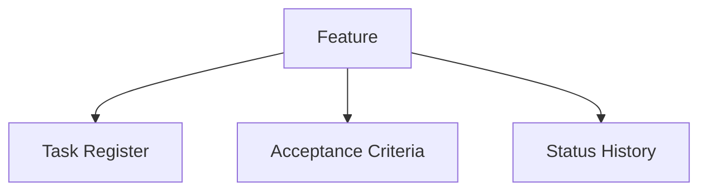

# <feature_title>

## Overview
<spec_context>

## Acceptance Criteria
- <criterion>
- <criterion>

## Working Plan
- Draft plan: <initial plan>
- Verification: <checked against memory, canon scope, and current repo state>
- Final plan: <approved execution plan>

## Task Register
- `TASK-001 | state=todo | owner_session=unassigned | <task description> | updated_at=<timestamp>`

## Status History
- `<timestamp> | <session> | created feature | initialized note`

## Mermaid Context Map

